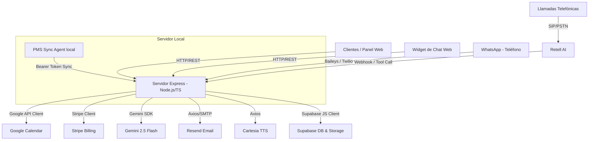

# Auditoría Técnica y Manual de Continuidad: Receptia v3
Este documento constituye una auditoría exhaustiva y un manual técnico de la aplicación **Receptia** (v1.3.7), un sistema SaaS multi-inquilino de recepción telefónica y chat automatizado mediante Inteligencia Artificial. Este informe está diseñado específicamente para que cualquier desarrollador o Inteligencia Artificial (IA) pueda asimilar la arquitectura, el modelo de datos, los flujos lógicos, las integraciones y continuar con el mantenimiento y evolución del sistema sin fricción.

---

## 1. Arquitectura General y Stack Tecnológico
Receptia está estructurado como una aplicación **Node.js** modular escrita en **TypeScript**, exponiendo un servidor web mediante **Express** y utilizando una base de datos PostgreSQL alojada en **Supabase** como núcleo de persistencia.

El sistema opera bajo un enfoque multi-inquilino (*Multi-Tenant*), donde cada cliente comercial (*tenant*) cuenta con su propia configuración de asistente de voz (Retell AI), su agenda conectada (Google Calendar), su canal de chat (WhatsApp Web/Twilio) y su ciclo de facturación (Stripe).



### Tecnologías Clave Utilizadas:
*   **Lenguaje y Entorno**: Node.js v24+, TypeScript 6.0+, Express 5.2+.
*   **Base de Datos y Almacenamiento**: Supabase (PostgreSQL 15+ con RLS y Storage para assets públicos/audios).
*   **Agente de Voz**: Retell AI (API v2, con modelos GPT-4o e inyección de prompts de sistema dinámicos).
*   **Agente de Texto**: Gemini 2.5 Flash (utilizado para el motor del chatbot web y WhatsApp con tool calling).
*   **Calendario**: Google Calendar API v3 (con flujo OAuth2 offline e invitaciones automáticas por email).
*   **Facturación y Pagos**: Stripe API (Suscripciones SaaS recurrentes, cobro metrado por consumo de minutos y pasarela Checkout para fianzas "No-Show").
*   **Comunicaciones**: `@whiskeysockets/baileys` (cliente WhatsApp Web automatizado mediante escaneo de QR) y Twilio API (como fallback premium).
*   **Email Marketing y Notificaciones**: Resend API (para emails transaccionales y de prospección/outreach).
*   **Sintetizador TTS**: Cartesia AI (para generación de audios ultrarrealistas personalizados en español).

---

## 2. Esquema de Base de Datos (Modelo de Datos)
La base de datos PostgreSQL en Supabase gestiona la lógica de inquilinos, citas, transacciones contables, contratos y campañas outbound. A continuación se desglosan las tablas, relaciones e inconsistencias detectadas en los DDLs locales.

### 2.1. Tabla: `tenants`
Almacena el perfil, preferencias, credenciales de APIs de terceros y configuraciones de comportamiento del asistente para cada comercio.
*   `id` (UUID, PK): Identificador único del inquilino.
*   `business_name` (TEXT, NOT NULL): Nombre del comercio/negocio.
*   `email` (TEXT, UNIQUE, NOT NULL): Correo electrónico del comercio (usado como login).
*   `admin_pin` (TEXT): PIN de 4 dígitos para acceder al panel de control de cliente.
*   `google_refresh_token` (TEXT): Token de actualización de Google OAuth para acceder al calendario.
*   `retell_agent_id` (TEXT): ID del agente de Retell AI asignado de forma dedicada a este inquilino.
*   `specialties` (TEXT[]): Array de especialidades/servicios que ofrece (ej. `['Medicina General', 'Fisioterapia']`).
*   `voice_id` (TEXT): Identificador de la voz del catálogo (ej. `cartesia-Hailey-Spanish-latin-america`).
*   `phone_number` (TEXT): Número de teléfono administrativo del comercio.
*   `business_description` (TEXT): Breve resumen sobre la empresa inyectado en el prompt de la IA.
*   `pricing_details` (TEXT): Información de tarifas inyectada en el prompt de la IA.
*   `custom_instructions` (TEXT): Instrucciones personalizadas introducidas por el cliente para moldear el comportamiento del agente.
*   `demo_calls_count` (INT): Contador de llamadas de prueba consumidas.
*   `working_hours` (JSONB): Horario comercial semanal (lunes a domingo con turnos `start` y `end`).
*   `vacation_mode` (BOOLEAN): Indica si el establecimiento está cerrado temporalmente por vacaciones.
*   `vacation_message` (TEXT): Mensaje de voz personalizado a emitir si el modo vacaciones está activo.
*   `voice_speed` (NUMERIC): Velocidad del habla del agente (0.8 a 1.2).
*   `voice_temperature` (NUMERIC): Variabilidad tonal de la voz.
*   `voice_responsiveness` (NUMERIC): Sensibilidad de respuesta/latencia.
*   `whatsapp_reminder_hours` (INT): Horas de antelación para el envío automático de recordatorios de cita.
*   `email_notifications_enabled` (BOOLEAN): Controla el envío de correos.
*   `client_whatsapp_enabled` (BOOLEAN): Habilita o deshabilita notificaciones automáticas por WhatsApp.
*   `client_email_enabled` (BOOLEAN): Habilita o deshabilita invitaciones por email al paciente/cliente.
*   `client_whatsapp_provider` (TEXT): Canal de envío de mensajes (`'qr'` para WhatsApp Web local o `'twilio'`).
*   `twilio_account_sid` / `twilio_auth_token` / `twilio_whatsapp_number` (TEXT): Credenciales específicas de Twilio si el cliente usa su propio número premium.
*   `client_whatsapp_connected` (BOOLEAN): Indica si la sesión de WhatsApp Web está vinculada (conectada con éxito mediante QR).
*   `block_admin_access` (BOOLEAN): Restringe que la cuenta de administrador global visualice datos sensibles de este cliente (PIN, base de conocimientos, etc.).
*   `personality_tone` (INT): Nivel de formalidad del habla (1: Muy formal, 5: Muy coloquial).
*   `personality_focus` (INT): Orientación del habla (1: Empático/Lento, 5: Resolutivo/Rápido).
*   `personality_speed` (NUMERIC): Velocidad del habla en Retell (sincronizada).
*   `text_back_enabled` (BOOLEAN): Habilita el envío de WhatsApp en caso de llamadas perdidas/no contestadas.
*   `text_back_message` (TEXT): Mensaje del WhatsApp de recuperación a enviar.
*   `chatbot_enabled` (BOOLEAN): Habilita el widget web de chat y el chatbot de texto en WhatsApp.
*   `chatbot_welcome_message` (TEXT): Mensaje inicial del chatbot.
*   `pms_sync_token` (TEXT): Token Bearer para autenticar el agente PMS local en la agenda en la nube.
*   `pms_last_sync` (TIMESTAMP): Fecha y hora de la última sincronización del PMS.
*   `pms_database_type` (TEXT): Tipo de base de datos local conectada (`'gesden'`, `'dentrix'`, `'none'`).
*   `agenda_optimization_enabled` (BOOLEAN): Activa el agrupamiento inteligente de citas.
*   `stripe_customer_id` (TEXT): ID de cliente en Stripe.
*   `stripe_subscription_id` (TEXT): ID de suscripción activa en Stripe.
*   `subscription_status` (TEXT): Estado de suscripción (`'trial'`, `'active'`, `'suspended'`, `'inactive'`).
*   `subscription_plan` (TEXT): Nombre legible del plan activo.
*   `price_amount` (NUMERIC): Precio recurrente del plan.
*   `billing_cycle` (TEXT): Ciclo de cobro (`'monthly'`, `'annually'`).
*   `contract_template_id` (UUID): Enlace a la plantilla legal de contrato firmada.
*   `signed_contract_content` (TEXT): Texto legal completo firmado por el cliente.
*   `is_trial` (BOOLEAN) / `trial_ends_at` (DATE): Control del ciclo de pruebas gratuitas.
*   `legal_address` / `tax_id` / `representative_name` / `representative_id` / `representative_role` / `signing_city` (TEXT): Datos fiscales y legales para el contrato formal de prestación de servicios.

### 2.2. Tabla: `appointments`
Gestiona las citas reservadas por la IA o sincronizadas desde el PMS local.
*   `id` (UUID, PK): ID único de la cita.
*   `tenant_id` (UUID, FK -> `tenants.id`): Comercio al que pertenece la cita.
*   `patient_name` (TEXT): Nombre completo del cliente/paciente.
*   `patient_phone` (TEXT): Teléfono de contacto.
*   `patient_email` (TEXT): Email de contacto.
*   `date_time` (TIMESTAMP WITH TIME ZONE): Fecha y hora reservada.
*   `specialty` (TEXT): Servicio o especialidad médica solicitada.
*   `status` (TEXT): Estado de la cita (`'confirmed'`, `'pending_payment'`, `'cancelled'`).
*   `google_event_id` (TEXT): ID del evento generado en Google Calendar para actualizaciones directas.
*   `google_calendar_id` (TEXT): ID del calendario destino (por defecto `'primary'`).
*   `professional_name` (TEXT): Nombre del profesional específico que atiende la cita (modo multi-profesional).

### 2.3. Tabla: `plans`
Especifica los planes de monetización SaaS disponibles.
*   `id` (TEXT, PK): ID del plan (ej. `estandar_mensual`, `premium_mensual`).
*   `name` (TEXT): Nombre comercial.
*   `price` (NUMERIC): Tarifa base.
*   `cycle` (TEXT): Frecuencia (`'monthly'` o `'annually'`).
*   `features` (TEXT[]): Array de características del plan.
*   `description` (TEXT): Resumen visual.

### 2.4. Tabla: `call_logs`
Almacena el historial y análisis semántico de las llamadas.
*   `id` (UUID, PK): ID único del registro.
*   `tenant_id` (UUID, FK -> `tenants.id`): Comercio receptor.
*   `caller_phone` (TEXT): Número del llamante (con formato `+34600000000|retell:call_id` para evitar duplicidades).
*   `call_duration` (INTEGER): Duración total en segundos.
*   `recording_url` (TEXT): URL del MP3 de la llamada grabada en Retell.
*   `transcript` (TEXT): Transcripción textual completa del diálogo.
*   `summary` (TEXT): Resumen semántico elaborado por el LLM.
*   `intent_tag` (TEXT): Clasificación (`'Cita Agendada'`, `'Llamada Perdida'`, `'Consulta General'`, `'Queja'`).
*   `retell_call_id` (TEXT): ID único de la llamada en Retell AI.

### 2.5. Tabla: `chat_messages`
Registra el historial de conversaciones del widget web y WhatsApp para alimentar al chatbot Gemini.
*   `id` (UUID, PK): ID del mensaje.
*   `tenant_id` (UUID, FK -> `tenants.id`): Comercio.
*   `session_id` (TEXT): Identificador de la sesión (número de teléfono o ID de widget).
*   `sender` (TEXT): Quién emite el mensaje (`'user'` o `'ai'`).
*   `content` (TEXT): Cuerpo del mensaje.
*   `created_at` (TIMESTAMP WITH TIME ZONE).

### 2.6. Tabla: `prospects`
Guarda los clientes potenciales extraídos mediante scraping para el pipeline de prospección.
*   `id` (UUID, PK): ID del lead.
*   `business_name` (TEXT): Nombre comercial del lead.
*   `email` (TEXT): Email de contacto.
*   `phone` (TEXT): Teléfono.
*   `website` (TEXT): Sitio web.
*   `address` (TEXT): Ubicación física.
*   `sector` (TEXT): Categoría (ej. `peluqueria`, `dental`).
*   `specialties` (TEXT[]): Especialidades deducidas de su web.
*   `demo_tenant_id` (UUID): ID del tenant demo temporal creado para el lead.
*   `demo_url` (TEXT): Enlace al panel demo para que el lead lo pruebe.
*   `audio_url` (TEXT): URL del audio de presentación TTS autogenerado en Cartesia.
*   `status` (prospect_status): Estado del flujo (`'extracted'`, `'demo_created'`, `'audio_generated'`, `'email_sent'`, `'failed'`).
*   `classification` (TEXT): Categorización (por defecto `'no_contactado'`).
*   `opened_at` (TIMESTAMP) / `opened_count` (INT): Estadísticas de apertura del email de outreach.
*   `error_details` (TEXT): Detalles de fallo del pipeline.

### 2.7. Tablas adicionales:
*   `settings` (PK: `key`, `value`): Guarda configuraciones globales del sistema (API keys, Price IDs de Stripe, etc.).
*   `contract_templates` (PK: `id`, `title`, `content`): Almacena las plantillas de contratos legales en HTML/Markdown.
*   `outbound_campaigns` / `outbound_campaign_recipients`: Soporte para campañas de llamadas salientes automatizadas con inyección de variables dinámicas al agente de Retell.

> [!WARNING]
> **Tabla ausente en scripts SQL de inicialización**:
> La tabla `whatsapp_auth_states` no figura en `supabase_schema.sql` ni en las migraciones de base de datos. Es indispensable para persistir las credenciales de WhatsApp Web (`baileys`) en la base de datos evitando la pérdida de sesiones tras reinicios del backend. Su DDL omitido es:
> ```sql
> CREATE TABLE IF NOT EXISTS whatsapp_auth_states (
>   tenant_id UUID REFERENCES tenants(id) ON DELETE CASCADE,
>   key_type VARCHAR NOT NULL,
>   key_id VARCHAR NOT NULL,
>   data JSONB,
>   PRIMARY KEY (tenant_id, key_type, key_id)
> );
> ```

---

## 3. APIs y Endpoints
El backend expone múltiples endpoints REST que manejan la lógica del sistema. A continuación se listan y agrupan según su funcionalidad.

### 3.1. Gestión de Inquilinos y Autenticación
*   `GET /api/tenants`: Obtiene los detalles de un inquilino por `email` o `id`. Si no se pasan parámetros, devuelve la lista completa de inquilinos activos.
    *   *Nota*: Si el inquilino tiene habilitado `block_admin_access`, los campos sensibles (`admin_pin`, `custom_instructions`, `business_description`, `pricing_details`, `vacation_message`, `knowledge_base_content`) se retornan como campos redactados (`"Acceso bloqueado..."`), a menos que la petición incluya el PIN correcto en los headers (`x-client-pin`) o query params.
*   `POST /api/auth/login`: Autentica a un inquilino con su `email` y `pin`.
*   `POST /api/tenants`: Registra o actualiza la configuración de un inquilino.
*   `DELETE /api/admin/tenants/:id`: Archiva ( soft delete ) un inquilino por ID.
*   `GET /api/admin/tenants/archived`: Devuelve los inquilinos archivados en el sistema.
*   `POST /api/client/tenants/:id/change-pin`: Modifica el PIN de acceso del comercio.

### 3.2. Citas (Appointments)
*   `GET /api/appointments`: Obtiene las citas de un inquilino filtradas por rango de fechas.
*   `PUT /api/appointments/:id`: Modifica los datos de una cita existente (fecha, hora, servicio) y actualiza de forma síncrona el evento en Google Calendar.
*   `DELETE /api/appointments/:id`: Cancela y elimina una cita en Supabase y su evento asociado en Google Calendar.

### 3.3. Facturación y Stripe
*   `POST /api/payments/create-checkout-session`: Genera una URL de Stripe Checkout para iniciar una suscripción a un plan mensual/anual. Asegura un plan metrado de minutos excedentes en la misma suscripción.
*   `POST /api/payments/create-portal-session`: Genera una URL de redirección al Stripe Customer Portal para que el comercio gestione o cancele su suscripción.
*   `POST /api/payments/webhook`: Webhook oficial de Stripe que escucha eventos críticos:
    *   `checkout.session.completed`: Si la metadata es `no_show_deposit`, confirma una cita que estaba retenida como `'pending_payment'`. Si no, activa e inicializa una suscripción de inquilino (`subscription_status = 'active'`).
    *   `invoice.payment_succeeded`: Registra un ingreso contable en la tabla `accounting_transactions`.
    *   `customer.subscription.deleted`: Cambia el estado del inquilino a `inactive` y sincroniza con Retell AI para desactivar la contestación telefónica activa.
    *   `invoice.payment_failed`: Suspende administrativamente al inquilino (`subscription_status = 'suspended'`) y sincroniza con Retell AI para emitir el mensaje de suspensión de voz.
*   `POST /api/payments/checkout-success`: Verifica si una sesión de checkout de fianza se completó con éxito.

### 3.4. Contabilidad y Contratos
*   `GET /api/admin/transactions` / `POST /api/admin/transactions` / `DELETE /api/admin/transactions/:id`: ABM de transacciones contables manuales.
*   `GET /api/admin/contracts` / `POST /api/admin/contracts` / `PUT /api/admin/contracts/:id` / `DELETE /api/admin/contracts/:id`: ABM de plantillas de contratos legales.
*   `POST /api/admin/contracts/generate`: Compila una plantilla HTML inyectando datos del inquilino y representante.
*   `POST /api/admin/tenants/:id/send-contract`: Asocia una plantilla a un inquilino y genera el contrato pendiente.
*   `POST /api/client/tenants/:id/sign-contract`: Guarda la firma digital del comercio aceptando los términos y condiciones.

### 3.5. Webhooks de Integración (Retell AI & PMS)
*   `POST /api/webhook/get-availability`: Consultor de disponibilidad de huecos libres en Google Calendar.
*   `POST /api/webhook/book-appointment`: Reserva de citas. Si la fianza está activa, crea la cita como `'pending_payment'`, genera el checkout de Stripe y envía el link por WhatsApp.
*   `POST /api/webhook/verify-payment`: Herramienta de verificación de fianza. Consulta si la cita se encuentra en estado `'confirmed'`.
*   `POST /api/webhook/cancel-appointment`: Cancela la cita identificada por teléfono/email del paciente y elimina el evento del calendario.
*   `POST /api/webhook/reschedule-appointment`: Cambia la hora de una cita en Google Calendar y Supabase previa comprobación de disponibilidad.
*   `POST /api/webhook/agent-events`: Escucha eventos de llamada de Retell (`call_analyzed`, `call_ended`). Almacena los logs de llamada, calcula y reporta minutos de exceso a Stripe en segundo plano, realiza el missed-call text-back y envía alertas de insatisfacción.
*   `POST /api/integrations/pms/sync`: Endpoint que recibe sincronizaciones periódicas desde un PMS local (Gesden, Dentrix) y actualiza la agenda de Supabase.

### 3.6. Catálogo y Clonación de Voces
*   `GET /api/voices-catalog` / `POST /api/voices-catalog` / `DELETE /api/voices-catalog/:id`: Gestión del catálogo de voces premium de la plataforma.
*   `POST /api/voice/clone`: Recibe una grabación en base64 y realiza la clonación express (Instant Voice Cloning) mediante ElevenLabs, asociándola de inmediato al tenant.

### 3.7. Chatbot y WhatsApp Web
*   `POST /api/chat/widget`: Endpoint que conecta al widget web de texto (Gemini 2.5 Flash con herramientas).
*   `GET /api/client/whatsapp/status`: Devuelve el estado de conexión del inquilino en WhatsApp Web (`qr`, `connected`, `disconnected`).
*   `POST /api/client/whatsapp/connect`: Inicializa una sesión de Baileys para el inquilino y genera el código QR para el emparejamiento.
*   `POST /api/client/whatsapp/disconnect`: Finaliza y limpia la sesión activa de WhatsApp Web.

### 3.8. Prospección y Outreach
*   `GET /api/prospecting`: Lista de prospectos guardados.
*   `POST /api/prospecting/search`: Dispara la extracción automatizada en Google Maps.
*   `POST /api/prospecting/trigger-pipeline`: Endpoint asíncrono para ejecutar el flujo de demostración de un prospecto.
*   `GET /api/outreach/track-open`: Endpoint para registrar lecturas de correos vía píxel de seguimiento.

---

## 4. Flujos lógicos detallados

### 4.1. El Pipeline de Prospección (Outreach)
Este flujo automatiza la captación en frío. Se ejecuta en segundo plano tras invocar `/api/prospecting/trigger-pipeline`:
1.  **Carga del Lead**: Recupera la información del negocio en `prospects` y el tenant de origen para clonación.
2.  **Creación del Tenant Demo**: Crea una fila en `tenants` simulando la configuración base, adaptando descripciones, catálogo de servicios, base de conocimientos y personalizando las instrucciones del LLM (reemplazando el nombre del comercio anterior por el del lead).
3.  **Aprovisionamiento de Retell AI**: Llama a Retell para crear un LLM dedicado con el prompt personalizado del lead y las herramientas de cita asociadas a los webhooks del servidor. Obtiene un `retell_agent_id` que guarda en el tenant.
4.  **Generación de Audio TTS**: Llama a Cartesia para generar un MP3 personalizado. El texto menciona al comercio por su nombre real, explica la simulación de llamada y ofrece 7 días gratis en Corandar. Sube el MP3 al storage de Supabase.
5.  **Envío de Correo (Resend)**: Envía un correo elegante inyectando el enlace de su panel de cliente y el MP3 autogenerado, además de un píxel de seguimiento oculto. Cambia el estado del prospecto a `'email_sent'`.

### 4.2. Flujo de Reserva con Fianza obligatoria (No-Show Deposits)
Cuando el usuario solicita cita en una llamada (Retell) o chat (Gemini):
```
[IA / Asistente] 
      │ 
      ▼
Llama a tool 'crear_cita' (con fecha, hora, especialidad, teléfono...)
      │
      ▼
[API Server - processBookingFlow()]
      │
      ├──> Comprueba disponibilidad real en Google Calendar
      │
      ├──> ¿Fianza Activa en Tenant? (enable_no_show_deposits = true)
      │          │
      │          ├──> SÍ: 
      │          │     1. Reserva cita en Google Calendar con prefijo "[PENDIENTE DE PAGO]"
      │          │     2. Registra en Supabase con status = 'pending_payment'
      │          │     3. Genera link de Stripe Checkout por el monto de fianza configurado
      │          │     4. Envía por WhatsApp el enlace de pago seguro de Stripe inmediatamente
      │          │     5. Retorna a la IA: "payment_required" (El agente le pide que pague en línea)
      │          │
      │          └──> NO:
      │                1. Reserva cita en Google Calendar de forma normal
      │                2. Registra en Supabase con status = 'confirmed'
      │                3. Envía confirmación por WhatsApp y retorna "confirmed"
```
Una vez que el usuario paga en Stripe:
1.  Stripe emite el webhook `checkout.session.completed` con metadata `type = 'no_show_deposit'`.
2.  El servidor Express actualiza el status en Supabase a `'confirmed'`.
3.  Actualiza el evento de Google Calendar eliminando el prefijo `[PENDIENTE DE PAGO]`.
4.  Inserta la fianza cobrada en `accounting_transactions`.
5.  Envía mensaje de WhatsApp final confirmando la cita al paciente.

### 4.3. Facturación por minutos excedentes (Metered Billing)
Para evitar pérdidas en llamadas extremadamente largas en la cuenta del host:
1.  Retell AI finaliza la llamada y emite `call_analyzed` a `/api/webhook/agent-events`.
2.  El servidor registra los segundos de la llamada en `call_logs`.
3.  Se ejecuta `processMeteredBillingForCall(tenantId, seconds)` en segundo plano.
4.  Consulta en Stripe la suscripción activa del inquilino y determina su período de facturación actual.
5.  Suma la duración de todas las llamadas finalizadas del inquilino durante el ciclo actual en Supabase (redondeando los segundos de cada llamada al minuto superior de forma independiente).
6.  Determina el límite mensual gratuito contratado en base al Price ID del plan principal de Stripe (Standard: 200 min, Premium: 500 min).
7.  Si la suma de minutos acumulados supera el límite del plan, calcula la porción excedente de esta llamada en concreto y reporta el consumo de minutos a la API de Stripe (`/usage_records`) bajo el Price ID de cobro metrado de consumo por uso.

---

## 5. Lógica de Negocio y Reglas Especiales

### 5.1. Sincronización Horaria de Madrid
Para evitar desajustes debido a que el servidor de node.js suele ejecutarse en UTC (ej. servidores de Render en Oregón), el sistema cuenta con la función `getMadridDate` en googleCalendar.ts. Esta función normaliza cualquier fecha y hora local introducida al estándar UTC respetando la zona horaria `'Europe/Madrid'`, lo que previene que citas agendadas por la tarde terminen registradas al día siguiente.

### 5.2. Regla de Descansos de Peluquería Carlos Romero
Existe una lógica hardcodeada estricta para el inquilino con ID `'62d1ed82-287c-4329-941b-50b578c15b14'`. Para este comercio:
*   La duración por bloque es de 15 minutos.
*   **Regla de descansos**: Por cada dos bloques consecutivos de citas (30 minutos en total), el sistema exige dejar un bloque (15 minutos) libre de descanso, a menos que la cita entrante sea un bloque continuado más grande (de 3 o 4 bloques correspondientes a servicios complejos).
*   Esta validación se ejecuta en `checkConsecutiveBlockRule` en googleCalendar.ts y previene la fatiga física del personal del local.

### 5.3. Optimización Dinámica de Agenda
Si el inquilino tiene habilitada `agenda_optimization_enabled`, el consultor de disponibilidad cambia su comportamiento:
*   En lugar de retornar los huecos de calendario ordenados cronológicamente, puntúa cada hueco libre:
    *   **+10 puntos** si el hueco es adyacente al inicio o fin del horario laboral.
    *   **+15 puntos** si el hueco es adyacente a una cita ya existente (promoviendo la compresión de agenda para evitar horas muertas sueltas).
    *   **-20 puntos** si reservar ese hueco crearía una "isla" aislada de solo 15 o 30 minutos a cada lado que difícilmente se pueda volver a agendar.
*   Los huecos se ordenan de mayor a menor puntuación y el LLM le ofrece proactivamente estas ranuras óptimas al usuario.

---

## 6. Debilidades, Vulnerabilidades y Bugs Críticos
Durante el análisis minucioso del código, se identificaron varios fallos de seguridad y diseño que deben abordarse en futuras actualizaciones.

### 6.1. Exposición Crítica de API Keys Privadas (Vulnerabilidad de Seguridad)
El endpoint `GET /api/admin/settings` no cuenta con **ningún método de autenticación ni autorización** (tampoco tiene asignado middleware de verificación). Cualquier atacante o cliente malicioso puede realizar una petición GET a este endpoint y recibir todas las filas de la tabla `settings`, exponiendo en texto plano credenciales ultra-sensibles:
*   `STRIPE_SECRET_KEY`
*   `RETELL_API_KEY`
*   `GEMINI_API_KEY`
*   `ELEVENLABS_API_KEY`
*   `RESEND_API_KEY`
*   `CARTESIA_API_KEY`

Igualmente, `POST /api/admin/settings` es completamente abierto, permitiendo que cualquiera reemplace los tokens de APIs globales del negocio.

### 6.2. Endpoints de Administrador sin Autenticar
Los endpoints `/api/admin/backup` (descarga completa de inquilinos y citas) y `/api/admin/restore` (que permite realizar upserts masivos en la base de datos) no requieren tokens ni tokens de sesión, lo que expone al sistema a robos de bases de datos o inyecciones masivas de información.

### 6.3. Hardcodeo de Credenciales y Contraseñas de Base de Datos
El endpoint `/api/admin/run-migration` en src/index.ts contiene un array en memoria con contraseñas en texto plano para probar la conexión directa con PostgreSQL en Supabase. Si bien facilita la migración en despliegues automatizados, es una brecha importante al quedar guardadas en el repositorio.

### 6.4. Inestabilidad del Botón de Conexión de WhatsApp Web (Baileys)
La automatización de WhatsApp Web mediante la biblioteca Baileys (`@whiskeysockets/baileys`) realiza ingeniería inversa sobre el protocolo de WhatsApp Web simulando un navegador.
*   **Riesgos**: Este canal no es oficial y es sumamente sensible a bloqueos automáticos por sospecha de spam por parte de Meta.
*   **Fugas de sockets**: Si la conexión falla de forma intermitente, se inician reintentos cada 5 segundos. Si hay fallos de red persistentes, el volumen de sockets paralelos puede saturar la pila de memoria del backend en Render.

### 6.5. Pérdida del Hilo del Worker de Campañas Salientes (Outbound)
En src/routes/campaigns.ts, la ejecución de las llamadas de campaña opera mediante una función asíncrona autoejecutable (`IIFE`) que ejecuta llamadas de Retell una a una aplicando un retraso (*throttle*) manual de 15 segundos en memoria.
*   **Problema**: Si el servidor se reinicia (por ejemplo, debido al ciclo de apagado automático de Render Free o un crash por memoria), el estado de ejecución de la campaña que corría en memoria se destruye. Las citas pendientes no se llamarán jamás y la campaña quedará colgada indefinidamente en estado `'running'`.

### 6.6. Reset Automático de Planes en Base de Datos (Inconsistencia de Código)
El script DDL de inicialización de Supabase (`supabase_schema.sql`) y las funciones dinámicas del servidor ejecutan sentencias destructivas en el arranque:
```sql
DELETE FROM plans WHERE id IN ('estandar', 'premium', 'anual');
```
Si un administrador edita los precios o características de los planes desde el portal web o directamente en la base de datos, estos cambios serán **borrados y restablecidos a los valores por defecto** cada vez que el servidor Express arranque de nuevo.

---

## 7. Instrucciones para la Continuidad del Desarrollo (Para IAs)
Si eres una Inteligencia Artificial encargada de actualizar este software, lee detenidamente estas directrices para mantener la integridad del código:

1.  **Firma del Código**: Cada vez que realices una edición o agregues características al código, **debes incrementar la versión semántica** del proyecto en el archivo [package.json](file:///e:/APPS/Receptia%20-%20v3/package.json) (campo `"version"`). Si no lo haces, romperás las directrices del proyecto.
2.  **Mantenimiento de zonas horarias**: Todas las comprobaciones y agendamientos de Google Calendar deben tratarse mediante las funciones de asistencia de googleCalendar.ts para asegurar la conversión de husos horarios locales a Madrid.
3.  **Seguridad RLS y Supabase Bypass**: El cliente Supabase del backend se inicializa con la clave `service_role` privada. Asegúrate de no exponer esta clave al frontend bajo ningún concepto.
4.  **Bypass de RLS**: Dado que el backend opera como administrador del sistema, no requiere políticas RLS activas en las tablas, pero si agregas endpoints públicos que se conecten directamente desde un cliente JS de frontend, debes verificar las políticas de seguridad en Supabase.
5.  **Despliegue Render**: Cualquier cambio en el backend se despliega automáticamente en Render cuando se confirma el commit en la rama `main` del repositorio `receptia-backend` en GitHub (gestionado mediante `scripts/deploy.ts`).
